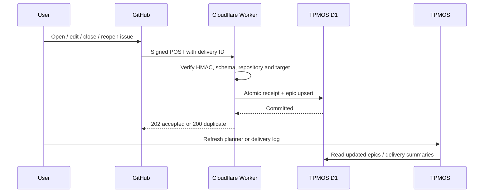

# GitHub webhooks: hosted setup and practice

GitHub sends signed issue events to a Cloudflare Worker. The Worker verifies the signature and repository, then updates linked TPMOS epics in Cloudflare D1. Use the hosted app from any machine; no local server, GitHub App, access token, or paid tunnel is required for normal use. You need a TPMOS administrator account and owner/admin access to the GitHub repository.



## Quick start in the web app

1. Open [TPMOS Integrations](https://tpmos.torfinn.xyz/admin/connectors/) and sign in through Cloudflare Access with a TPMOS administrator account.
2. In **GitHub webhooks**, enter the repository as `OWNER/REPOSITORY` and its numeric repository ID. For a public repository, open `https://api.github.com/repos/OWNER/REPOSITORY` in your browser and copy the top-level `id` field. For a private repository, use authenticated GitHub CLI: `gh api repos/OWNER/REPOSITORY --jq .id`. This is a setup lookup; TPMOS stores no GitHub access token.
3. Select a demo team and an open quarter. Use a separate practice plan: GitHub events create and update real epics in that selected plan. Click **Connect repository**.
4. Copy the generated **GitHub payload URL** and **Secret**. The secret is shown only after connection creation or explicit rotation. Keep it private.
5. In the GitHub repository, open **Settings → Webhooks → Add webhook**. Enter the payload URL, choose **application/json**, paste the secret, and leave SSL verification enabled. Select **Let me select individual events → Issues**. Leave **Active** checked and save. GitHub sends a `ping`.
6. Return to TPMOS and select **Refresh deliveries**. A `ping` result confirms the signed connection reached the receiver.
7. Create a GitHub issue. Refresh the TPMOS planner for the chosen team and quarter: it now contains the linked epic.

The receiver is `https://tpmos-github-webhooks.torfinnolsen.workers.dev/github/CONNECTION_ID`. Copy the exact URL shown in TPMOS. Do not use the human-login-protected TPMOS URL as GitHub’s webhook destination.

## Preconnected practice repository

[ItssooverWeRsoBack/webhook-practice](https://github.com/ItssooverWeRsoBack/webhook-practice) is connected to the **Webhook Practice** team and quarter. [Open the practice plan](https://tpmos.torfinn.xyz/plan/?team=webhook-practice&quarter=default%3Awebhook-practice) after signing in. [Issue #1](https://github.com/ItssooverWeRsoBack/webhook-practice/issues/1) was used to verify real opened/edited/closed/reopened deliveries and redelivery without duplicate epic writes. You can use that issue or create another.

The webhook is already configured on this repository; you do not need its secret to practice issue events. To administer it, use repository owner/admin access. Creating issues requires normal GitHub permissions.

## What updates

| GitHub event/action | TPMOS behavior |
|---|---|
| `ping` | Records a connectivity check; creates no epic |
| `issues.opened` | Creates the linked epic, or updates the existing mapping |
| `issues.edited` | Updates title and description; keeps TPMOS effort, DRI, votes, and open-issue progress |
| `issues.closed` | Sets status to `done` and completion to 100% |
| `issues.reopened` | Reopens a completed epic to `not_started`, completion 0% |
| Other issue actions or event types | Records `ignored`; does not update epics |

GitHub owns title, description and open/closed state for linked epics. Description includes the GitHub issue link. Titles are capped at 200 characters and bodies at 4,500 characters in TPMOS; the source issue stays unchanged. Numeric repository ID plus issue number identifies the external issue. Each connection targets one team and quarter; different plans can have separate connections.

Only new delivered events are ingested. Connecting does not backfill historical issues. Editing an existing issue after connection will ingest that issue. There is no writeback from TPMOS to GitHub, push/commit ingestion, pull-request mapping, scheduled polling, or WebSocket browser broadcast. Refresh the planner or switch back to its tab to fetch current data.

## Practice exercises

1. **Create:** Open an issue titled “Webhook practice: first epic.” Look for `applied` in TPMOS deliveries and a new epic in the chosen plan.
2. **Edit:** Change its title/body. Refresh the plan; the same epic changes instead of a duplicate appearing. Set an effort estimate in TPMOS and edit again on GitHub; the estimate remains.
3. **Close/reopen:** Close the GitHub issue, observe `done` / 100%, then reopen and observe `not_started` / 0%.
4. **Replay:** In GitHub **Settings → Webhooks → your webhook → Recent deliveries**, open a delivery and select **Redeliver**. Its response reports `duplicate: true`; the same epic remains and its version does not increment again.
5. **Reject a bad secret:** Temporarily put a different secret in GitHub and generate a delivery. Expect 401. Restore the correct secret, then redeliver. Failed signatures never produce TPMOS writes.
6. **Rotate:** Click **Rotate secret** in TPMOS, replace the secret in GitHub, and generate a fresh event. The previous secret immediately stops working. Old failed deliveries can be redelivered using GitHub’s current webhook configuration.
7. **Disable:** Disable the connection in TPMOS and create an issue; the receiver returns 404 and makes no changes. Re-enable and manually redeliver.

GitHub does not automatically retry failed repository webhook deliveries; use Recent deliveries / Redeliver after fixing a failure. See [GitHub’s handling documentation](https://docs.github.com/en/webhooks/using-webhooks/handling-webhook-deliveries).

## Multiple GitHub accounts and private repositories

Create each webhook while logged into an account with repository owner/admin permissions. Different accounts can send to the same hosted receiver using different TPMOS connection URLs and secrets. TPMOS matches the signed event’s repository ID and name, not whichever GitHub account is open in your browser. Private repository payloads work too when their numeric ID/name are configured correctly; no provider token is needed by the receiver. Their delivery summaries remain behind TPMOS authentication.

Renaming/transferring a repository changes its configured full name. Disable the old connection and create a new one with the correct name, or return it to the configured name. Automatic transfer/rename reconciliation is not implemented. Reconnecting uses a new connection identity and may create another epic mapping.

## Delivery guarantees and limits

- The raw request bytes are checked with HMAC-SHA256 before parsing JSON. Header-only identity claims do not authenticate a webhook. See [GitHub signature validation](https://docs.github.com/en/webhooks/using-webhooks/validating-webhook-deliveries).
- A D1 batch commits a compact delivery receipt and the epic mutation together. If a write fails, no receipt is committed; redelivery can retry safely.
- Delivery IDs remain in a compact identity ledger; old duplicate deliveries stay idempotent even after their display summary is pruned. The latest 100 summaries per connection are kept, and the UI shows the latest 50. Raw payloads, signatures, and secrets are never stored in the log.
- Events with an older issue `updated_at` timestamp are recorded as `stale` without overwriting current data. GitHub timestamps have second precision; different events with the same timestamp follow arrival order, not guaranteed causal order.
- A closed quarter or unavailable/archived team returns 409. Move to a new open-quarter connection if planning is complete. No automatic quarter reassignment is performed.
- A connection’s secret is derived from the deployment master key and its secret version. Rotation changes the signature key immediately. Replacing the master key requires updating both deployments and every GitHub webhook secret.
- Requests are limited to 256 KiB; oversized bodies return 413. No AI, external-provider writes, background schedules, or paid tunnel are introduced.

## Troubleshooting

| Response/result | Meaning / next step |
|---|---|
| 202 / `applied` | Accepted and committed; refresh the planner |
| 202 / `ping` | Setup succeeded; create an issue next |
| 200 / `duplicate: true` | Delivery already processed; no repeat epic write |
| 202 / `stale` | An older event arrived after a newer issue snapshot |
| 202 / `ignored` | Unsupported action/event; subscribe to Issues |
| 400 | Invalid JSON, delivery headers, issue fields, or issue URL |
| 401 | Wrong/missing webhook secret or changed raw request body |
| 403 | Repository ID/name does not match this connection |
| 404 | Wrong receiver path, unknown connection, or disabled connection |
| 409 | Target quarter is closed or team/organization scope is unavailable |
| 413 | Body exceeds the practice receiver’s size limit |
| 503 | Deployment secret missing or database write failed; fix and redeliver |

GitHub’s delivery detail shows request headers/payload and response. Invalid signatures are not recorded in TPMOS’s authenticated delivery log; inspect GitHub for those failures.

## Deployment for maintainers

The initial receiver shares the existing TPMOS D1 database and runs separately from Pages human authentication. It never bypasses the Pages middleware.

1. Apply migration `0010_github_webhooks.sql` with `npm run db:migrate:prod`. Back up an existing production database first.
2. Generate a random master key (at least 32 characters) privately. Set the same `WEBHOOK_MASTER_KEY` as a Cloudflare secret on both Pages and the receiver Worker:

   ```bash
   npx wrangler pages secret put WEBHOOK_MASTER_KEY --project-name tpmos
   npx wrangler secret put WEBHOOK_MASTER_KEY --config webhooks/wrangler.toml
   ```

3. Set Pages `CLOUDFLARE_ACCESS_TEAM` to the Access team slug and `CLOUDFLARE_ACCESS_AUD` to this TPMOS application’s audience tag. Production authentication now requires a cryptographically verified Access JWT with the expected issuer/audience and an unexpired token. It does not trust an arbitrary email header or an unsigned cookie. Keep all human routes protected by the existing Access application.
4. For another deployment, change the new receiver’s D1 binding in `webhooks/wrangler.toml` and set Pages `WEBHOOK_RECEIVER_URL` to its HTTPS origin. The existing Pages/root build configs remain unchanged.
5. Deploy the receiver:

   ```bash
   npx wrangler deploy --config webhooks/wrangler.toml
   ```

6. Build/push the TPMOS app through its existing Pages pipeline. Confirm that the app rejects unverified production identity headers, `/dev/login` remains 404 in production, and the receiver rejects missing signatures.
7. Use the hosted setup steps above. Secrets entered at prompts belong in Cloudflare secrets, never committed `.env`, command logs, issue bodies, or screenshots.

### Cost

This design uses Workers and D1 features available on Cloudflare’s Free plan. The current [Workers Free allowance](https://developers.cloudflare.com/workers/platform/pricing/) includes 100,000 requests/day; [D1 Free](https://developers.cloudflare.com/d1/platform/pricing/) includes 5 million rows read/day, 100,000 rows written/day and 5 GB total storage. These limits are shared across the account, not dedicated to this receiver. Small practice workloads fit comfortably, but this is not an unlimited-free guarantee. Existing paid-plan accounts retain their billing/overage rules; no paid plan is enabled by this setup. The connected deployment credential cannot read account subscriptions, so this release does not certify a $0 bill. Confirm **Workers Free** in your Cloudflare billing dashboard if you require hard free-plan quotas rather than paid-plan overages.

### Developer verification

```bash
npm run typecheck
npm test
npm run lint
npm run build
npx wrangler deploy --config webhooks/wrangler.toml --dry-run
```

Tests exercise the actual SQLite migrations and SQL, signed body validation, issue lifecycle, old/repeated deliveries, failed-write rollback, secret rotation, tenant boundaries and production Access validation. Synthetic tests use no GitHub/AI API calls. Local tooling is optional validation; the primary user workflow is hosted.

## Code map

| Location | Responsibility |
|---|---|
| `webhooks/worker.ts` | Public Cloudflare receiver entry point |
| `webhooks/wrangler.toml` | Separate receiver deployment and D1 binding |
| `functions/_lib/connectors/github-webhook-receiver.ts` | Signature, payload, repository and target validation |
| `functions/_lib/connectors/github-webhook-store.ts` | Atomic receipt / epic update and bounded log |
| `functions/api/tpmos/github-webhooks/` | Authenticated administrator setup, rotation and delivery log |
| `src/components/tpmos/connectors/github-webhooks.tsx` | Hosted setup controls |
| `src/lib/tpmos/schemas/github-webhook.ts` | Shared runtime contracts |
| `migrations/0010_github_webhooks.sql` | Connection, delivery and epic timestamp storage |
